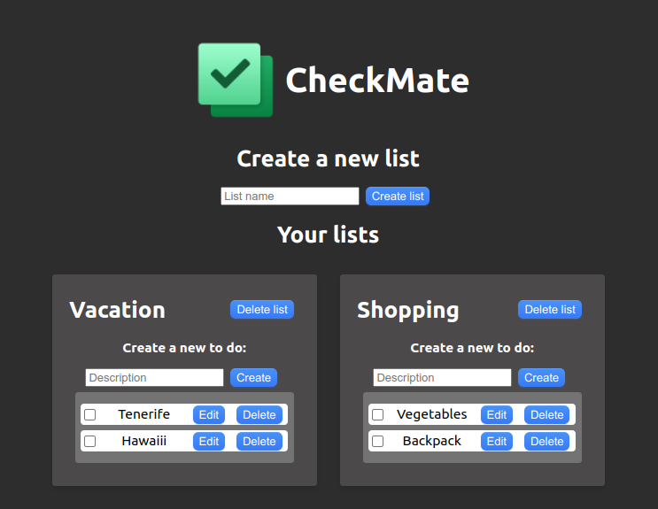

# Todo App



Build a To-Do application where a user can create a to-do list, add items to their list, mark items as completed, and be able to remove items from their list.

Build a server and a website. You will not be judged on the appearance of the page, so it can be plain HTML, completely without styling. The purpose of the page is to show that you can connect a front-end with a back-end.

The user's lists should be saved in a database.

## Getting Started

Step 1 install dependencies via terminal.

    npm install

Step 2 add ".env" file in the root of the project, with this data, fill empty with your info:

    DATABASE_USER = 'root'
    DATABASE_PASSWORD = ''
    DATABASE_HOST = '127.0.0.1'
    DATABASE_DATABASE = 'Alexander_Wiklow_TODODB'

Step 3 in listapp folder:

    npm start

step 4 in server folder:

    nodemon index.js

## Table of contents

- [Todo App](#todo-app)
  - [Getting Started](#getting-started)
  - [Table of contents](#table-of-contents)
    - [The challenge](#the-challenge)
    - [Built with](#built-with)
  - [Author](#author)

### The challenge

Users should be able to:

- Register yourself
- Log in
- Create a to-do list (if you're logged in)
- Add items to a to-do list (if you're logged in)
- Remove items from a to-do list (if you're logged in)
- Edit items in a to-do list (if you're logged in)
- If you log in as a user, you should be able to leave the website and come back without having to log in again. Use cookies for this.
- You should be able to have multiple lists, and you should also be able to add other users as friends, and then see their lists.

Requirements:

- You should be able to register yourself.
- You should be able to log in and stay logged in (using cookies).
- You should be able to create a to-do list (if you're logged in).
- You should be able to add items to a to-do list (if you're logged in).
- You should be able to remove items from a to-do list (if you're logged in).
- You should be able to edit items in a to-do list (it's enough to be able to mark items as done/undone) (if you're logged in).
- All your endpoints should use validation. I should only be able to send information that is used by your endpoint.
- The client should receive the correct status codes.
- The client should receive the correct status messages.
  -You must use the correct HTTP methods. It should not be a POST when deleting a resource.
- You should use at least one router (Express.Router).
- You must have a good project structure. It's not okay to have all files in one folder.
- There should not be console.logs that don't belong to the code design.
- There should not be commented-out code (comments are okay).
  -There should be a website that implements all the functionality that your server offers. Postman is not enough.
- You should store the user's information in a database; storing it on the server is not enough.
- You should be protected against SQL injections (using prepared statements).
- You should use at least one custom middleware.
  Sensitive information in .env files should be hidden (for example, login information for the database).
- You should store hashed passwords.
- You should be able to add friends (the friend must be registered on the site).
- You should be able to see your friends' to-do lists.
- You should use JWT or another similar token for authentication.

<!-- ### Links

- Solution URL: [Add solution URL here](https://your-solution-url.com)
- Live Site URL: [Add live site URL here](https://your-live-site-url.com) -->

<!-- ## My process -->

### Built with

- Semantic HTML5 markup
- CSS custom properties
- Flexbox
- SCSS
- Mobile-first workflow
- [React](https://reactjs.org/) - JS library
- [Node.js](https://nodejs.org/en) - JavaScript runtime environment
- [Express](https://expressjs.com/) - Web framework for Node.js
- [MySQL](https://www.mysql.com/) - Relational database management system
<!-- ### What I learned

Use this section to recap over some of your major learnings while working through this project. Writing these out and providing code samples of areas you want to highlight is a great way to reinforce your own knowledge.

To see how you can add code snippets, see below:

```html
<h1>Some HTML code I'm proud of</h1>
```

```css
.proud-of-this-css {
  color: papayawhip;
}
```

```js
const proudOfThisFunc = () => {
  console.log("🎉");
};
```

If you want more help with writing markdown, we'd recommend checking out [The Markdown Guide](https://www.markdownguide.org/) to learn more.

**Note: Delete this note and the content within this section and replace with your own learnings.**

### Continued development

Use this section to outline areas that you want to continue focusing on in future projects. These could be concepts you're still not completely comfortable with or techniques you found useful that you want to refine and perfect.

**Note: Delete this note and the content within this section and replace with your own plans for continued development.**

### Useful resources

- [Example resource 1](https://www.example.com) - This helped me for XYZ reason. I really liked this pattern and will use it going forward.
- [Example resource 2](https://www.example.com) - This is an amazing article which helped me finally understand XYZ. I'd recommend it to anyone still learning this concept.

**Note: Delete this note and replace the list above with resources that helped you during the challenge. These could come in handy for anyone viewing your solution or for yourself when you look back on this project in the future.** -->

## Author

- Website - [Alexander Wiklöw](https://alexanderwiklow.github.io/Portfolio2023/)
